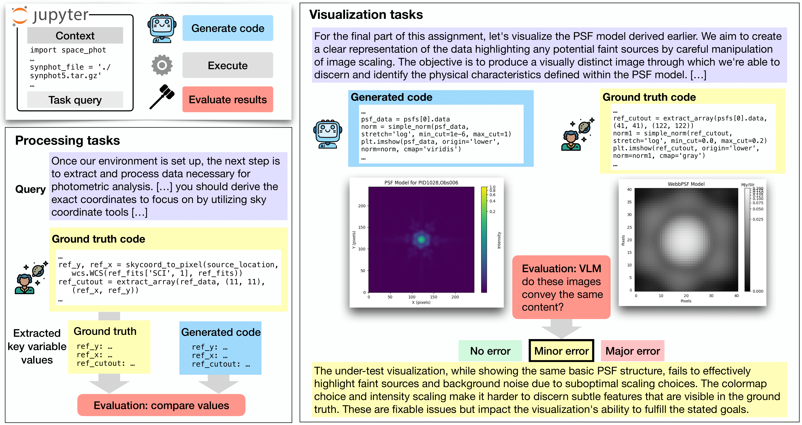

<p align="center">
  <a href="#">
    
  </a>
</p>




This is the repository containing the code needed to run the AstroVisBench benchmark as detailed in the paper ["AstroVisBench: A Code Benchmark for Scientific Computing and Visualization in Astronomy"](https://arxiv.org/abs/2505.20538).
The benchmark is available [here](https://huggingface.co/datasets/sebajoe/AstroVisBench) as a huggingface dataset. However, we highly recommend converting this benchmark into a JSON file in order to be used in along with scripts in this repository. You can find this raw JSON file [here](https://utexas.box.com/s/2evj5cs3u2gqndvgc9sd66cmlggl9fg1) under `astrovisbench_queries.json`.

## Environment Setup

You need to have `conda` installed in your system. Make sure to create a separate environment as follows:

```bash
conda create -n <env_name> python=3.10
```

After you have created this environment, navigate to the `reqs_resolve` directory and run the bash script.

```bash
bash install_packages.sh
```

You will also need to download and decompress the **bench environment**, which contains the file states necessary to run the benchmark.

This is optional but you can also download and decompress the **ground truth cache** to speed up the benchmark execution, although this cache will be automatically built in your first run of the benchmark. 

You can download the above files and the present state of the benchmark using this [link](https://utexas.box.com/s/2evj5cs3u2gqndvgc9sd66cmlggl9fg1). The bench environment should be stored under `bench_env.tar.gz` and the ground truth cache should be stored under `gt_processing_cache.tar.gz`.

**CAUTION:** Setting up this environment and executing the benchmark will consume a large amount of storage. Please have at least 100 GB of free space available in your system.

## Using the Benchmark

The benchmark is a json file with the following schema:

```
|
| - setup_query : NL query for setting up imports and environments
| - setup_gt_code : Initial code for setting up imports and environments
| - processing_query : NL query for processing and analyzing data prior to visualization
| - processing_gt_code : Ground truth code associated with the processing query
| - visualization_query : NL query for visualizing results
| - visualization_gt_code : Ground truth code associated with the visualization query
| - processing_underspecifications : clarifications for underspecified portions of the processing query
| - visualization_underspecifications : clarifications for underspecified portions of the visualization query
| - gt_visualization: ground truth visualization in base64 form
| - processing_gen_code : TO BE FILLED OUT BY LLM - generated code responding to the processing query
| - visualization_gen_code : TO BE FILLED OUT BY LLM - generated code responding to the visualization query
```

You will need to use your target LLM to fill out the last two fields listed above. The code listed under these fields are what are being evaluated. The file `generate_code.py` under the `generate_code` directory is one possible way you could generate code for the purpose of this benchmark.

This is the setup we used to evaluate LLM in the AstroVisBench paper:
- **Processing:** Setup Query, Ground Truth Setup Code, Processing Query + Processing Underspecifications
- **Visualization:** Setup Query, Ground Truth Setup Code, Processing Query + Processing Underspecifications, Ground Truth Processing Code, Visualization Query

### Execution

After you have properly setup your environment and finished filling out the benchmark, you can start the evaluation process. This involves running the `exec_bench.py` script. Here are the arguments you need to specify:

```
python exec_bench.py \
<FILLED BENCHMARK> \
<PATH TO BENCH ENVIRONMENT> \
--true-cache <PATH TO GROUND TRUTH CACHE> \
--gen-cache <PATH TO GENERATED CODE PROCESSING CACHE> \
--vis-cache <PATH TO GENERATED VISUALIZATION CACHE> \
--outfile <PATH TO OUTPUT JSON FILE> \
--skip-test \ # This is a flag to skip the processing equivalency test and only fill up the execution caches
--temp-caching \ # Anti-ballooning measure. Deletes cache after processing tests.
--min-diff-only \ # Omits including all differences between every comparison in the output json file
--run-all \ # Perform tests on all queries instead of skipping already completed queries
```

#### Ballooning 

When executing the benchmark, the generated cache may balloon massively in size as it stores every variable produced in the LLM-generated code.
To combat this, you can specify the `--temp-caching` parameter, which will delete the cache associated with each query after it is executed.

#### Multiprocessing

This code supports multiprocessing through MPI. If you are running this script using an MPI job make sure to add the tag `--MPI`. You will need to split you benchmark JSON file into however many splits you will like. You can use `split_queries.py` to do this. These JSON splits must end in `<SPLIT NUMBER>.json`. Once this is done, you can start your MPI job by giving the prefix path of your splits (i.e. `bench_split_` is the prefix of `bench_split_0.json`) to `exec_bench.py` instead of the `<FILLED BENCHMARK>` argument. Similarly, the output files will have `<SPLIT NUMBER>.json` appended to its name when the script is run.

#### Processing Evaluation

The variable inspection test is performed in tandem with the code execution (unless you specify `--skip-test` in your arguments). The results of this test is located in the output json under `processing_test`. This contains the execution output, whether or not the code executed without error, and the results of the test under `inspection_results`. Under `agg_scores` you will find the unweighted and weighted (by variable depth) scores for this task. We also provide you with the detailed breakdown of how each variable was compared and the distance scores attached to each comparison. 

### Visualization Evaluation

After you are done executing, you can do the visualization evaluation with our LLM-as-a-judge method. Use the `vis_evaluation.py` script under the `vis_evaluation` directory to do so as follows:

```
python vis_evaluation.py \
<EXECUTED BENCHMARK JSON> \
<PATH TO OUTPUT JSON FILE> \
```

You will get three trials of error categorization and rationale output from the LLM for each query.  

### Results Aggregation

You can aggregate all the results after passing you benchmark json file through all these pipelines using the `aggregate_results.py`. This script will output a JSON dict containing the execution success rates for both the processing and visualization tasks, the average variable inspection scores, and the distribution of errors from the visualization evaluation.

## Citation & License

We release the benchmark under the [CC BY-SA 4.0](https://creativecommons.org/licenses/by-sa/4.0/deed.en) license.

Please use the following citation if you found our work to be useful in your work.

```
@misc{joseph2025astrovisbenchcodebenchmarkscientific,
      title={AstroVisBench: A Code Benchmark for Scientific Computing and Visualization in Astronomy}, 
      author={Sebastian Antony Joseph and Syed Murtaza Husain and Stella S. R. Offner and Stéphanie Juneau and Paul Torrey and Adam S. Bolton and Juan P. Farias and Niall Gaffney and Greg Durrett and Junyi Jessy Li},
      year={2025},
      eprint={2505.20538},
      archivePrefix={arXiv},
      primaryClass={cs.CL},
      url={https://arxiv.org/abs/2505.20538}, 
}
```
